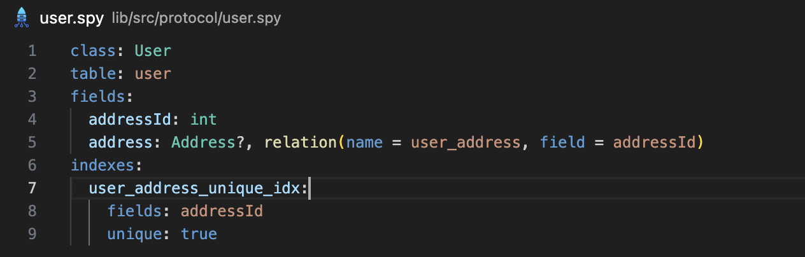

# Serverpod

[Serverpod](https://serverpod.dev) is a next-generation app and web server, built for the Flutter community. It allows you to write your server-side code in Dart, automatically generate your APIs, and hook up your database with minimal effort. Serverpod is open-source, and you can host your server anywhere.

## Key features

Syntax highlighting in protocol files.

Real-time diagnostics show errors in protocol files as you type.

<video>
  <source src="assets/videos/diagnostics.mov" type="video/mp4">
</video>

## Requirements

You need the Serverpod (^1.2.0) CLI installed in your path for this extension to work. Run the following command in your terminal to install it:

`dart pub global activate serverpod_cli`

Note: The Serverpod CLI requires both [Dart and Flutter](https://docs.flutter.dev/get-started/install.) to be installed.
